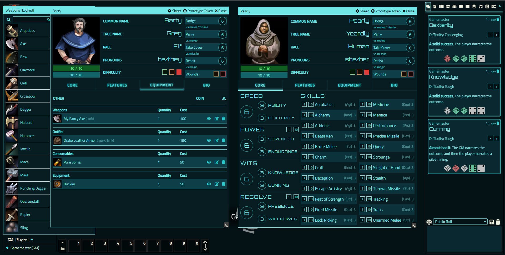

# Cryptomancer System

Cryptomancer RPG system for Foundry Virtual Tabletop

> Kill all the Orcs, Hack all the Things

## Prerequisites

A [FoundryVTT](https://foundryvtt.com/) license and a copy of [Cryptomancer](http://cryptorpg.com/).

## Install

### In Foundry

Search for Cryptomancer in the "Install System" dialog in Foundry.

### Manifest URL

Paste the manifest path into the "Manifest URL" field on the install system dialog in Foundry.

`https://github.com/OfficerHalf/cryptomancer-fvtt/releases/latest/download/system.json`

### Manually

Unzip `system.zip` from the latest release into your Foundry `Data/systems/cryptomancer` folder.

## Use

### Supported Features (so far!)

- Player Character sheets
- Skill checks with skill break/skill push and configurable check difficulty
- Stuff (consumables, equipment, outfits, weapons)
  - Item skill checks
  - Automatic DR tracking
- Talents and Spells
- Compendia containing all the Talents, Spells, and Stuff included in the core rules as well as Code and Dagger 1
- Party and Safehouse sheet

Note that while the system still has a version less than 1.0.0 there will be some inherent instability. Migrations will be performed, please raise an issue if there are problems going between versions.

## Development

See [CONTRIBUTING.md](CONTRIBUTING.md).
